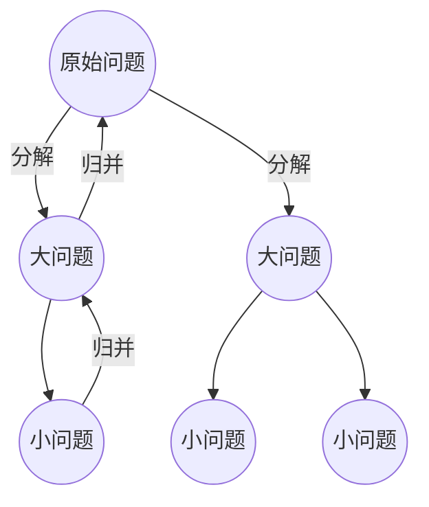

# 计算机网络

[TOC]

## 1. 0概述

## 1.1发展过程

### 1.1.1 面向终端的计算机网络

### 1.1.2 多台计算机互联的计算机网络

主干 地区 校园网

### 1.1.3 因特网

本地isp  地区isp 网络接入点(nap) 主干服务提供者

## 1.2 计算机网络基本概念

> - 计算机网络定义
>   - 把分布在不同地点且具有独立功能的多个计算机，通过通信设备和通信线路连接起来，在功能完善的网络软件运行环境下，以实现资源共享为目标的系统
> - 计算机网络的组成
>   - 图论: 边缘节点，中心节点，链路

## 1.3 网络类型及特征

根据网络拓扑结构

- 星型
- 树型
- 总线型
- 环型
- 网状型

根据网络覆盖范围

- 个人区域网
- 局域网
- 城域网
- 广域网

根据通信介质

- 有线网络
- 无线网络

## 2.0 网络协议与网络体系结构

### 知识要点

---

> - 掌握网络协议的基本概念以及网络协议三要素的含义
> - 了解计算机网络体系结构的概念
> - 掌握开放系统互连参考模型
> - 掌握tcp/ip体系结构
> - 理解两种结构的体系区别

1. 网络协议与分层体系结构
2. 开放系统互连参考模型osi/rm
3. tcp/ip体系结构
4. osi/rm和tcp/ip的比较
5. 网络通信标准化组织

### 协议三要素

- 语法: 怎么讲
- 语义: 讲什么
- 同步: 执行先后顺序

### 计算机网络体系结构

> 计算机网络体系结构是指计算机网络的分层，每一层应具有的功能以及每一层都用到的协议的集合

## 2.1 网络协议与分层体系结构

分层的原则

- 每层的功能应当明确，并且相互独立
- 层间接口要清晰，跨越接口的信息量要少
- 层数要适中

应表会传网数物

物链网传会表应

### 开放系统互连的参数模型

> osi未占领市场，并未推广开来，失败原因
>
> 1. osi 的专家们缺乏实际经验
> 2. osi的协议实现起来过分复杂运行效率较低
> 3. osi标准的制定周期太长
> 4. osi的层次划分不太合理

osi/rm体系结构 -> 五层的体系结构

> 应用层，表示层，会话层 -> 应用层

#### 应用层

直接为用户的应用进程提供服务

- http
- smtp
- mime

### 传输层

为两台主机中进程之间的通信提供服务

tcp / udp

### 网络层

为网络上的不同主机之间提供**分组**的传输服务

与传输层的区别，网络层源主机与目标主机通信， 传输层:源主机进程和目标主机进程(更加具体)

- ip(网际协议)

### 数据链路层

### 示例

主机甲向主机乙发送数据

1. QQ应用进程数据先传输到应用层
2. 加上应用层首部，成为应用层PDU(协议数据单元)
3. 传输层报文再传送到网络层
4. 加上网络层首部，成为IP数据报(或分组)
5. 数据链路层帧再传送到物理层
6. 最下面的物理层把比特流传送到物理媒体
7. 电信号或光信号在物理媒体中传播从发送端物理层传送到接收端物理层
8. 数据链路层剥去帧首部和帧尾部取出数据部分，上交给网络层
9. 网络层剥去首部，取出数据部分上交给传输层
10. 传输层剥去首部，取出数据部分上交给应用进程

