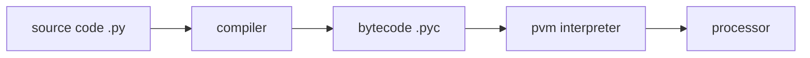

[TOC]

# 01 编程历史及特性

应用:

1. shell编程
2. 控制语言: 胶水语言
3. 框架: web, Django

# 02 初接触



## python实现

1. Cpython 原始标准的实现
2. Jython 用于与Java语言集成的实现
3. IronPython 用于与.Net框架集成的实现

## python性能优化工具

### psyco, 现被pypy取代

### PyPy, 用python实现的python解释器

### Shed Skin python编译器，能够将python代码转换成优秀的C++代码

### 类似HHVM将php编译成C++，Shed Skin亦如此

## 交互式解释器

## python程序文件

### 脚本

### 模块

### 执行

1. 新建.py文件
2. 第一行shebang，执行脚本时通知内容要启动的解释器
3. 第二行通过import 导入一个python模块platform
4. 第三行打印platform模块的uname方法的执行结果

```python
#!/usr/bin/python
import platform
print platform.uname()
```

```shell
chmod +x firstpycode.py
./firstpycode.py
```

python程序可分为

1. 模块
2. 语句
3. 表达式
4. 对象

## python ide

# 03 程序文件结构

面向过程

​	以指令为中心，由指令处理数据

面向对象

​	以数据为中心，所有的处理代码都围绕数据展开

​	如何设计数据结构组织数据，并提供对此类数据所允许处理操作

## python开发环境

```shell
dir(platform) # 查看
```

简单方法:

1. 编译安装新版本至某特定路径
2. pyenv

## python关键要素

- 基本数据类型
- 对象引用 
- 组合数据类型
- 逻辑操作符
- 控制流语句
- 算术操作符
- 输入/输出
- 函数的创建与调用

# 05 编程语言基础技术框架

对象引用 ，字母，数字，下划线

区分大小写

禁止使用保留字

## 常用组合数据类型

- 列表 
- 元组
- 字符串
- 集合
- 字典 可变

len() 获取元素个数

id()

# 07 输入/输出

```python
print("%s %s" % ('hello', 'world'))
dir(__builtins__)
help(str)
```

- 字典: kv集合 {'a': 31, 'b': 78}

```python
d = {"a": 21, "b": 31}
print("%(a)d %(b)d" % d)
```

# 08 函数

> def functionName(arguments): 
>
> ​	print name

- 内置函数
- 标准库，内置模块

过程式编程:

​	变量，表达式，语句，函数


# 09 python基本编程风格

## 注释: #

## 续行

- \
- ''' 闭合操作符，单一语句跨多行

## 代码组

## 文档

> 可通过\__doc__获取

## 缩进

> 统一缩进4个字串

## 命名惯例

- 以单一下划线开头的变量名(_x)不会被from module import * 语句导入
- 前后有下划线的变量名(\__x__) 是系统变量名，对解释器有特殊意义
- 以两个下划线开头，但结尾没有下划线的变量名(\__x)是类的本地变量
- 交互模式下，只有单个下划线的变量名(\_)用于保存最后表达式的结果

```python
#!/usr/bin/env python

"this is a test module"

import sys
import os

debug = True

class FooClass (object):
    "foo classs"
    
    pass

def test():
    "test function"
    foo = FooClass()
    
    if debug:
        print("ran test()")
        
if __name__ == '__main__'
	test()
```

> 每个模块都有一个名为\__name__的内建变量，此变量值会根据调用此模块的方式发一变化:
>
> 如果此文件作为模块导入，则值为模块名称
>
> 如果此文件被直接执行，则值为"\__main__"

# 11 python对象特性/比较及核心数据类型

对象相关术语

- python是强类型的语言
- 如果某个对象包含对其它对象的引用，则将其称为容器

两个对象的比较

- 值比较，对象中的数据是否相同
- 身份比较，两个变量名引用的是否为同一个对象
- 类型比较: 两个对象的类型是否相同

核心数据类型

- 数字: int, long, float, complex, bool
- 字符: str, unicode
- 列表: list
- 字典: dict
- 元组: tuple
- 文件: file
- 其它类型: 集合(set)， frozenset, 类类型, None

其它文件类工具: pipes, fifos, sockets, 

类型转换

​	str(), repr()或format()： 将非字符型数据转换成字符

​	int()

​	float()

​	list()

​	tuple()

​	set()

​	dict()

​	frozenset(s): 将字串s转换成不可变集合

