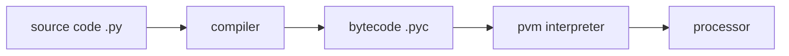

[TOC]

# 01 编程历史及特性

应用:

1. shell编程
2. 控制语言: 胶水语言
3. 框架: web, Django

# 02 初接触

## python实现

1. Cpython 原始标准的实现
2. Jython 用于与Java语言集成的实现
3. IronPython 用于与.Net框架集成的实现

## python性能优化工具

### psyco, 现被pypy取代

### PyPy, 用python实现的python解释器

### Shed Skin python编译器，能够将python代码转换成优秀的C++代码

### 类似HHVM将php编译成C++，Shed Skin亦如此

## 交互式解释器

## python程序文件

### 脚本

### 模块

