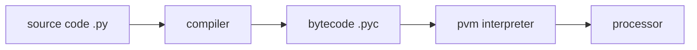

[TOC]

# 01 编程历史及特性

应用:

1. shell编程
2. 控制语言: 胶水语言
3. 框架: web, Django

# 02 初接触



## python实现

1. Cpython 原始标准的实现
2. Jython 用于与Java语言集成的实现
3. IronPython 用于与.Net框架集成的实现

## python性能优化工具

### psyco, 现被pypy取代

### PyPy, 用python实现的python解释器

### Shed Skin python编译器，能够将python代码转换成优秀的C++代码

### 类似HHVM将php编译成C++，Shed Skin亦如此

## 交互式解释器

## python程序文件

### 脚本

### 模块

### 执行

1. 新建.py文件
2. 第一行shebang，执行脚本时通知内容要启动的解释器
3. 第二行通过import 导入一个python模块platform
4. 第三行打印platform模块的uname方法的执行结果

```python
#!/usr/bin/python
import platform
print platform.uname()
```

```shell
chmod +x firstpycode.py
./firstpycode.py
```

python程序可分为

1. 模块
2. 语句
3. 表达式
4. 对象

## python ide

# 03 程序文件结构

面向过程

​	以指令为中心，由指令处理数据

面向对象

​	以数据为中心，所有的处理代码都围绕数据展开

​	如何设计数据结构组织数据，并提供对此类数据所允许处理操作

## python开发环境

```shell
dir(platform) # 查看
```

简单方法:

1. 编译安装新版本至某特定路径
2. pyenv

