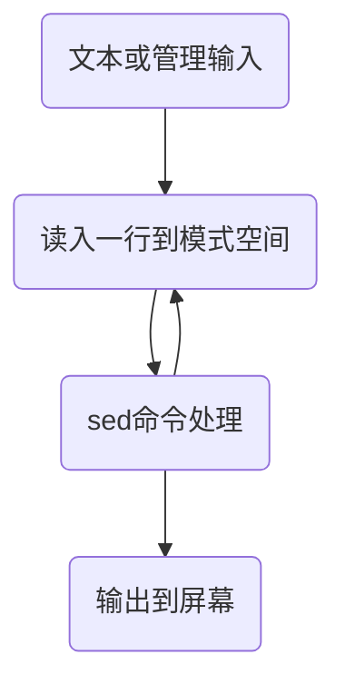

# vagrant | awk | sed

[TOC]

[vagrant慕课视频](https://www.imooc.com/video/14212)

## vagrant retry hostname name package public_ip


[awk sed](https://www.imooc.com/video/14507)

## sed和awk应用场景

例如: 在服务器日志fresh.log中，找到所有报错的日期

```shell
sed -n '/Error/p' fresh.log | awk '{print $1}'
```

## 正则表达式

### 应用与学习方法

- 查找所有包含linux的行
- 取出以abc开头的所有单词
- 匹配两位数、密码、QQ、身份证号等

### 字符/字符串/表达式

```shell
grep '[259]' passwd # 匹配2或5或9
grep '[a-zA-Z]' passwd
grep '[a-zA-z,:_/-().]' passwd

# 反向字符 [^0-9]
grep '[^0-9]' passwd
# 任意字符
grep . passwd
grep '[.]' passwd
grep '\.' passwd

# 边界字符: 头尾字符
# ^: ^root 注意与[^]的区别
grep '^root' passwd

# 尾字符
# false$
grep 'false$' passwd

# 空行 ^$
grep '^$' passwd

# 元字符 代表普通或特殊字符
# \w: 匹配任何字类字符，包括下划线 [(A-Za-z0-9_)]
# \W: 匹配任何非字类字符 ([^A-Za-z0-9_])
grep '\w' passwd
grep '\W' passwd

# \b 单词分隔
grep '\bx\b' passwd

# 字符组合

# 字符串 'root' '1000' '1..c' 
grep 'root' passwd
grep 'm..c' passwd
grep '[A-Z][0-9]' passwd
grep '[0-9][0-9]' passwd
grep '\b[0-9][0-9]\b' passwd

# 字符串组合 
# 1 重复 *， +， ？
	# s* : s se seeee
	# se? s se
	grep 'se\+' passwd
	grep 'se\?' passwd
	# (se)* se sese
	grep '\(se\)*' passwd
	# (se)+
	grep '\(se\)\+' passwd
	# (se)?
	grep '\(se\)\?' passwd
	# 重复特字的次数: {n,m}
	# *: {0,}
	# +: {1,}
	# ?: {0,1}
	grep '[0-9]\{0,3\}' passwd
	# 任意字符串 .*
	grep '^r.*' passwd
	grep 'm.*c' passwd
	grep '\bm.*c\b' passwd # 贪婪的匹配，可能与预期不一样
# 2 逻辑
	# |： 'bin\(false\|true\)'
	
	
	
# 匹配4-10位的QQ号
grep '[0-9]\{4,10\}' file

# 匹配15位到18位的身份份证号(支持带X的) 首位和未位 + 13或16位中间
grep '^[0-9]\([0-9]\{13\}\|[0-9]\{16\}\)[0-9xX]$' 

# 匹配密码(由数字、26个字母和下划线组成)
grep '^\w\+$' file
```


## sed基本处理

- 自动处理文件
- 分析日志文件
- 修改配置文件


### sed如何进行文件处理的

流处理编辑器



> 模式空间，即为临时缓冲区
>
> sed一次处理一行内容
>
> sed不改变文件内容，除非进行重定向
>
> sed 使用正则选定文本

### sed的基本操作命令

- 命令行格式

  ```shell
  $sed [options] 'command' file(s)
  # options: -e -n
  # command: 行定位(正则) + sed命令(操作)

  sed -n '/root/p'
  sed -e '10,20d' -e 's/false/true/g'

  sed 'p' passwd
  sed -n 'p' passwd

  # 行定位
  # 定位一行: x; /pattern/ 正则两边有斜杠
  sed -n '10p' passwd

  nl passwd | sed -n '10p'
  sed -n '/mooc/p' passwd

  # 定位几行: x,y; /pattern/,x;
  nl passwd | sed -n '10,20p' 
  nl passwd | sed -n '/news/,/mooc/p'

  # 取反操作
  nl passwd | sed -n '10!p' # 不选第10行
  nl passwd | sed -n '10,20!p' # 不选10到20行

  # 定位间隔几行: first-step
  nl passwd | sed -n '1~2p'


  # 基本操作命令2
  # a 新增行
  nl passwd | sed '5a ======================'
  nl passwd | sed '1,5a =================='
  # i 插入行
  nl passwd | sed '5i ===================='
  nl passwd | sed '1,5i ===================='
  # c 替换行
  nl passwd | sed '40c afafafafsafasf'
  nl passwd | sed '10c hello world'
  nl passwd | sed '35,40c hello world' # 整体替换
  # d 删除行
  nl passwd | sed '/root/d'

  # aicd 与vim操作命令一致


  # 优化服务器配置
  # 在ssh的配置文件加入相应文本
  # Port 52113
  # PermitRootLogin no

  sed '$a port 52113 \npermitrootlogin no ' ssh_config
  sed '$a\   port 52113 \n	permitrootlogin no' ssh_config
  # 删除空行
  sed '/^$/d' file

  # 服务器日志处理
  sed -n '/Error/p' logfile


  # 替换命令: -s 分隔符/,#等
  sed 's/false/true/' passwd
  sed 's/:/%/' passwd #仅替换一次
  sed 's/:/%/g'

  # 截取ip地址
  ifcofig ens33 | sed -n '/inet /p' | sed 's/inet.*r://' | sed 's/B.*$//'

  # 非info和debug日志
  sed -n '/\(info\|debug\)/I!p' logfile
  ```

- 脚本格式

  ```shell
  $sed -f scriptfile file(s)
  ```

  ​

#### 文本行处理（增、删、替）

#### 字符串替换(取用)

### sed的高级操作命令

```shell
# -{} 多个sed命令，用;分开
nl passwd | sed '{20,30d;s/false/true/}'

# -n 读取下一个输入行(用下一个命令去处理)
nl passwd | sed -n '{n;p}'
nl passwd | sed -n '{p;n}'
nl passwd | sed -n '1~2p'
nl passwd | sed -n '2~2p'
nl passwd | sed -n '1~5p'
nl passwd | sed -n '{n;p;n}'

# -& 替换固定的字符串
sed 's/^[a-z_-]\+/&	/' passwd

# 大小写转换: (\u\l\U\L)
sed 's/^[a-z_-]\+/\u&/' passwd

# 文件夹下的.txt文件名转换成大写
ls *.txt | sed 's/^\w\+/\U&/'

# 数据筛选 获取passwd中USER, UID和GID
sed 's/^\([a-z_-]\+\):.*/\1/'

sed 's/^\([a-z_-]\+\):.*/\1/' passwd
sed 's/^\([a-z]\+\):x:\([0-9]\+\):\([0-9]\+\).*/USER:\1   UID:\2  GID:\3/' passwd


# -\( \) ： 替换某种(部分) 字符串 (\1, \2)
# 数据筛选: 获取网卡ip
ifconfig ens33 | sed -n '/inet /p' | sed 's/ine.*r:\([0-9.]\+\) .*$/\1/'


# -r: 复制指定文件插入到匹配行 -w： 复制匹配行拷贝到指定文件里 ， w会改写文件


# q: 退出sed
nl passwd | sed '10q' # 到第10行结束
nl passwd | sed '/false/q' # 找到第一个false结束

```


## awk更为复杂的处理

- 文本与数据处理工具
- 可编程 处理灵活功能强大
- 统计、制表等

### 行处理方式与格式

- awk一次处理一行内容
- awk对每行可以切片处理

```shell
awk '{print $1}' // 输出首个单词 比sed的替换要简单

# 格式
# 1 命令行格式
# awk [options] 'command' file(s)

# 2 脚本格式
# awk -f awk-script-file file(s)

# 基本格式 awk [options] 'command' file(s)

	# command: pattern{awk 操作命令}
	# pattern: 正则表达式; 逻辑判断式
	# 操作命令: 
		# 内置函数: print() printf() getline..;
		# 控制指令: if() {...} else{...}; while() {...};
	
# 扩展格式
```


### 内嵌参数应用

- awk内置变量1

  - \$0 : 表示整个当前行
  - \$1 : 表示第一个字段
  - \$3 : 每行第三个字段

- 分隔符

  - options: -F field-separator (默认为空格)

    ```shell
    awk -F ':' '{print $3}' /etc/passwd
    awk -F ':' '{print $1,$3}' /etc/passwd
    awk -F ':' '{print $1" "$3}' /etc/passwd
    awk -F ':' '{print "user: "$1"\t uid:"$3}' /etc/passwd


    # 显示passwd中每行的行号，每列的列数，对应行的用户名(print, printf)
    awk -F ':' '{print "line: "NR, "Col: "NF, "User: "$1}' passwd
    awk -F ':' '{printf("Line: %s, Col: %s, User: %s\n", NR, NF, $1)}' passwd
    awk -F: '{printf("line: %3s, Col: %3s, user: %3s\n", NR, NF, $1)}' passwd

    # 显示/etc/passwd中用户ID大于100的行号和用户名(if...else...)
    awk -F ':' '{if ($3 > 100) print "Line: "NR, "User: "$1}' passwd


    # 在服务器log中找出'Error'的发生日期
    sed -n '/Error/p' logfile | awk '{print $1}'
    awk '/Error/{print $1}' logfile

    # 逻辑判断式
    # ~， !~: 匹配正则表达式
    # ==， !=, <,>: 判断逻辑表达式

    awk -F ':' '$1~/^m.*/{print $1}' passwd # 第一列以m开头
    awk -F ':' '$1!~/^m.*/{print $1}' passwd # 第一列不以m开头

    awk -F ':' '$3>100{print $1, $3}' passwd
    awk -F ':' '$3<100{print $1, $3}' passwd
    awk -F ':' '$3==100{print $1, $3}' passwd
    awk -F ':' '$3!=100{print $1, $3}' passwd


    ```

  - NR: 每行的记录号， 行号

  - NF: 字段数量变量, 列号

  - FILENAME: 正在处理的文件名

### 内嵌程序应用

```shell
# 扩展格式
# awk [options] 'command files(s)
# command2扩展： BEGIN{print "start"} pattern{commands} END{print "end"}
```

